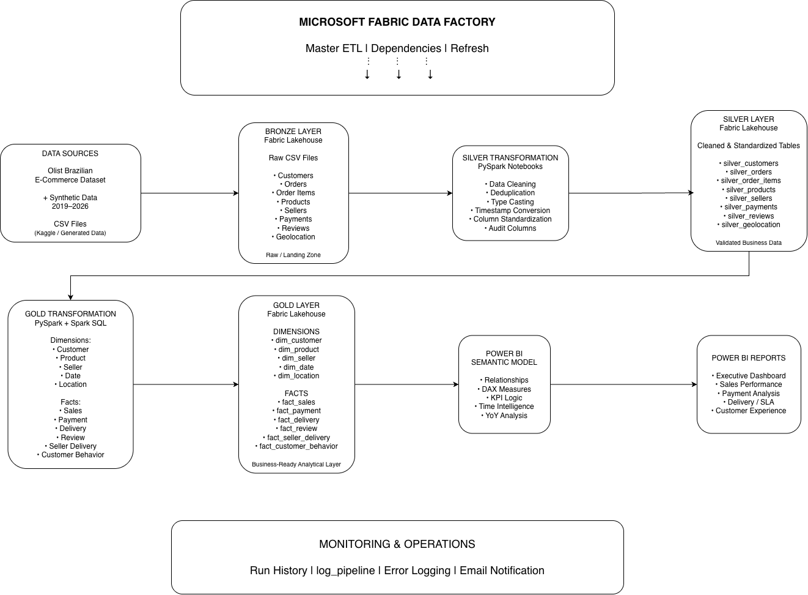
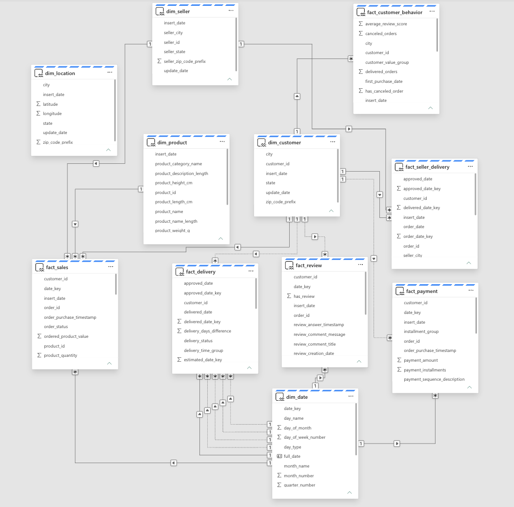
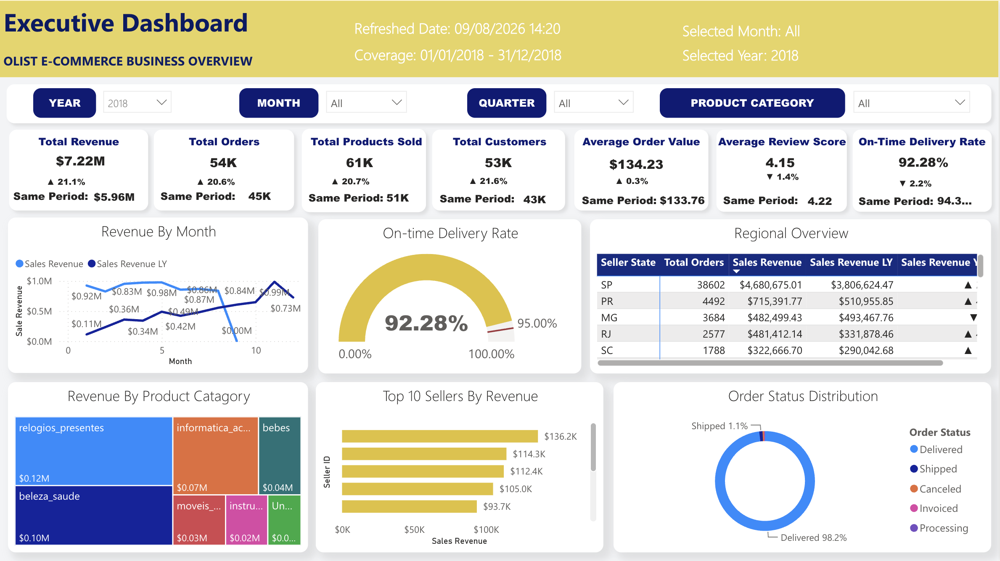

# OLIST E-Commerce Data Engineering & Analytics Project

End-to-end **Data Engineering and Data Analytics project** built with Microsoft Fabric, PySpark, Spark SQL, Data Factory Pipelines, Power BI Semantic Model, and Power BI.

This project demonstrates a complete analytical workflow from raw source data through the **Medallion Architecture** to business-ready dimensional models and reporting.

---

## Project Overview

The project was developed as an end-to-end Microsoft Fabric solution covering both **Data Engineering (DE)** and **Data Analytics (DA)**.

The implementation includes:

- Raw data ingestion into a Bronze Lakehouse
- PySpark-based Silver transformations
- Data cleaning, deduplication, and standardization
- Gold dimensional modeling
- Dimension and fact table development
- Microsoft Fabric Data Factory pipeline orchestration
- Master ETL workflow
- Pipeline dependencies and failure handling
- Centralized pipeline logging
- Power BI semantic modeling
- DAX measures and time intelligence
- Business intelligence reporting

The objective is to demonstrate how data can be transformed from raw transactional files into a structured analytical platform for business reporting.

---

## Solution Architecture

The project follows the **Medallion Architecture** pattern:

```text
Source Data
    |
    v
Bronze Lakehouse
    |
    v
Silver Transformation
    |
    v
Silver Lakehouse
    |
    v
Gold Transformation
    |
    v
Gold Lakehouse
    |
    v
Power BI Semantic Model
    |
    v
Power BI Reports
```

Microsoft Fabric Data Factory is used to orchestrate the ETL workflow, manage dependencies, monitor execution, handle failures, and refresh downstream analytical components.



[View detailed architecture documentation](docs/architecture/architecture.md)

---

## Dataset

This project uses the **Brazilian E-Commerce Public Dataset by Olist**, a public e-commerce dataset containing information about customers, orders, products, sellers, payments, reviews, and delivery activity.

The original dataset is used for the historical period.

Additional synthetic data was generated for **2019–2026** to extend the analytical time horizon and support:

- ETL scalability testing
- Year-over-year analysis
- Pipeline orchestration testing
- Power BI time intelligence
- Dashboard performance validation

The synthetic records are used only for portfolio and analytical testing purposes.

Raw datasets are not stored in this repository.

---

## Medallion Architecture

The data platform is organized into three logical layers:

```text
Bronze → Silver → Gold
```

Each layer has a separate responsibility within the analytical workflow.

### Bronze Layer — Raw Data

The Bronze Lakehouse acts as the raw landing zone for source files.

The source domains include:

- Customers
- Orders
- Order Items
- Products
- Sellers
- Payments
- Reviews
- Geolocation

The purpose of this layer is to preserve source data before business transformations are applied.

---

### Silver Layer — Cleaned & Standardized Data

PySpark notebooks transform Bronze data into cleaned and standardized Silver tables.

Key processing steps include:

- Duplicate removal
- Schema standardization
- Data type conversion
- Timestamp conversion
- Text normalization
- Audit timestamp management
- Data quality preparation

Core Silver tables:

```text
silver_customers
silver_orders
silver_order_items
silver_products
silver_sellers
silver_payments
silver_reviews
silver_geolocation
```

The Silver layer provides validated data for downstream analytical transformations.

---

### Gold Layer — Business-Ready Analytics

The Gold Lakehouse contains analytical tables designed for reporting and semantic modeling.

The layer follows a dimensional modeling approach using dimensions and fact tables.

#### Dimension Tables

```text
dim_customer
dim_product
dim_seller
dim_date
dim_location
```

#### Fact Tables

```text
fact_sales
fact_payment
fact_delivery
fact_review
fact_seller_delivery
fact_customer_behavior
```

The Gold layer provides business-ready data for the Power BI semantic model and downstream reporting.

---
## Analytical Data Model

The Gold layer is organized as a dimensional analytical model designed for Power BI reporting.

The model separates descriptive business entities into dimension tables and measurable business processes into fact tables.



The analytical model supports multiple business domains, including:

| Business Domain | Primary Fact Table |
|---|---|
| Sales Performance | `fact_sales` |
| Payment Analysis | `fact_payment` |
| Delivery & Logistics | `fact_delivery` |
| Customer Experience | `fact_review` |
| Seller Fulfillment | `fact_seller_delivery` |
| Customer Behavior | `fact_customer_behavior` |

The shared dimensions provide reusable filtering across the analytical model:

- `dim_date`
- `dim_customer`
- `dim_product`
- `dim_seller`
- `dim_location`

[View detailed data model documentation](docs/data-model/data_model.md)

---

## Data Engineering Notebooks

PySpark and Spark SQL notebooks implement the transformation logic across the Silver and Gold layers.

The notebook source code has been exported from Microsoft Fabric and included in this repository for portfolio review.

### Silver ETL Notebooks

The Silver notebooks clean and standardize source data before analytical modeling.

Main processing areas include:

- Customer transformation
- Order transformation
- Order item transformation
- Product transformation
- Seller transformation
- Payment transformation
- Review transformation
- Geolocation transformation

Typical Silver processing follows this workflow:

```text
Bronze Files
    ↓
Read CSV
    ↓
Remove Duplicates
    ↓
Standardize Schema
    ↓
Cast Data Types
    ↓
Clean / Normalize Values
    ↓
Add Audit Timestamps
    ↓
Write Delta Tables
```

### Gold Analytical Notebooks

Gold notebooks transform standardized Silver data into dimension and fact tables.

Dimension processing includes:

```text
dim_customer
dim_product
dim_seller
dim_date
dim_location
```

Fact processing includes:

```text
fact_sales
fact_payment
fact_delivery
fact_review
fact_seller_delivery
fact_customer_behavior
```

The Gold transformations use PySpark and Spark SQL for joins, aggregations, business rules, KPI preparation, and dimensional modeling.

[Browse notebook source code](notebooks/)

---
## Pipeline Orchestration

Microsoft Fabric Data Factory pipelines orchestrate the end-to-end ETL workflow.

The orchestration layer is responsible for:

- Executing Silver and Gold transformations in the required sequence
- Managing activity dependencies
- Coordinating dimension and fact processing
- Handling pipeline failures
- Triggering monitoring and logging activities
- Refreshing downstream analytical components

The project uses dedicated pipelines for different analytical processes rather than placing the entire ETL workflow inside a single pipeline.

### Dimension Pipelines

Dimension pipelines coordinate Silver processing and Gold dimension creation for core business entities such as:

- Customer
- Product
- Seller

Each pipeline follows an execution dependency pattern similar to:

```text
Silver Transformation
        ↓
Gold Dimension Transformation
        ↓
Semantic Model Refresh
        ↓
Success Notification
```

Failure paths are handled separately through logging and notification activities.

[View dimension pipeline documentation](pipelines/dimension_pipelines.md)

---

### Fact Pipelines

Fact pipelines create the analytical fact tables used by the Gold layer and Power BI semantic model.

The project includes analytical processing for:

- Sales
- Payments
- Reviews
- Delivery
- Seller Delivery
- Customer Behavior

Fact pipeline execution is coordinated after the required upstream Silver and dimension data is available.

[View fact pipeline documentation](pipelines/fact_pipelines.md)

---

## Master ETL Pipeline

The `Master_ETL` pipeline acts as the orchestration layer for the overall analytical workflow.

It coordinates downstream pipelines in a controlled execution sequence and provides a single entry point for running the major ETL processes.

A simplified orchestration flow is:

```text
Dimension Pipelines
        ↓
Fact Pipelines
        ↓
Downstream Analytical Processing
        ↓
Semantic Model Refresh
```

The Master ETL design makes the overall workflow easier to monitor, troubleshoot, and maintain.

[View Master ETL documentation](pipelines/master_etl.md)

---

## Monitoring & Logging

The project includes centralized monitoring and failure-handling logic for pipeline execution.

A Gold-layer table named:

```text
log_pipeline
```

is used to record pipeline execution failures and support troubleshooting.

The logging structure includes fields such as:

```text
pipeline_name
activity_name
table_name
status
error_message
log_time
```

A typical failure path follows this pattern:

```text
ETL Activity Fails
        ↓
Failure Logging Notebook
        ↓
log_pipeline
        ↓
Failure Email Notification
        ↓
Fail Activity
```

Additional monitoring is performed using Microsoft Fabric Pipeline Run History.

This design supports:

- Failed activity identification
- Error investigation
- Pipeline execution tracing
- Centralized failure logging
- Email failure notification
- Faster troubleshooting

[View monitoring and logging documentation](pipelines/monitoring_and_logging.md)

---
## Power BI Semantic Model

The Gold-layer analytical tables are consumed by a Power BI semantic model that provides reusable business logic for reporting and analysis.

The semantic model connects dimension and fact tables through defined relationships and supports:

- DAX measures
- KPI calculations
- Date-based filtering
- Time intelligence
- Year-over-year comparisons
- Cross-domain business analysis

The semantic model acts as the analytical layer between the Gold Lakehouse and Power BI reporting.

---

## Executive Dashboard

A Power BI Executive Dashboard was developed to provide a consolidated view of Olist e-commerce business performance.

The dashboard combines multiple analytical domains into a single executive-level reporting experience.

### Key Performance Indicators

- Total Revenue
- Total Orders
- Total Products Sold
- Total Customers
- Average Order Value
- Average Review Score
- On-Time Delivery Rate

### Analytical Views

The report provides analysis of:

- Revenue trends by month
- Current-period versus previous-period performance
- Revenue by product category
- Top sellers by revenue
- Regional sales performance
- Order status distribution
- Delivery performance
- Customer review performance

Users can interact with the report using:

- Year filters
- Month filters
- Quarter filters
- Product category filters
- Interactive visual cross-filtering
- Chart tooltips

### Dashboard Preview



### Report Demo

A short screen recording demonstrates the interactive behavior of the Power BI report, including slicers, KPI updates, filtering, and visual interactions.

[▶ Watch Executive Dashboard Demo](docs/reports/executive-dashboard-demo.mov)

[View detailed Executive Dashboard documentation](docs/reports/executive-dashboard.md)

> The original Power BI report uses a semantic model hosted in a managed Microsoft Fabric environment. The portfolio therefore provides a report screenshot and interaction demo rather than distributing the live-connected PBIX file.

---

## Technology Stack

| Area | Technology |
|---|---|
| Data Platform | Microsoft Fabric |
| Data Storage | Fabric Lakehouse / OneLake |
| Data Engineering | PySpark |
| Data Transformation | PySpark & Spark SQL |
| Data Architecture | Medallion Architecture |
| Analytical Modeling | Dimensional Modeling |
| Orchestration | Microsoft Fabric Data Factory |
| Monitoring | Pipeline Run History & Custom Logging |
| Semantic Layer | Power BI Semantic Model |
| Business Intelligence | Power BI |
| Version Control | Git & GitHub |

---

## Repository Structure

```text
OLIST_Ecommerce_DE-DA-Fabric-Project/
│
├── notebooks/
│   └── PySpark and Spark SQL transformation scripts
│
├── pipelines/
│   ├── master_etl.md
│   ├── dimension_pipelines.md
│   ├── fact_pipelines.md
│   ├── monitoring_and_logging.md
│   └── pipeline screenshots
│
├── docs/
│   │
│   ├── architecture/
│   │   ├── architecture.md
│   │   └── medallion-architecture.png
│   │
│   ├── data-model/
│   │   ├── data_model.md
│   │   └── star-schema.png
│   │
│   └── reports/
│       ├── executive-dashboard.md
│       ├── executive-dashboard.png
│       └── executive-dashboard-demo.mov
│
├── .gitignore
└── README.md
```

---

## Key Skills Demonstrated

This project demonstrates practical experience across both Data Engineering and Data Analytics, including:

- End-to-end analytical solution development
- Microsoft Fabric Lakehouse architecture
- Bronze, Silver, and Gold data layers
- PySpark ETL development
- Spark SQL transformations
- Data cleaning and standardization
- Data quality processing
- Dimensional data modeling
- Fact and dimension table design
- Microsoft Fabric Data Factory pipelines
- ETL dependency management
- Master pipeline orchestration
- Failure handling
- Centralized pipeline logging
- Semantic modeling
- DAX and time intelligence
- Power BI dashboard development
- Git and GitHub project documentation

---

## Project Workflow

```text
Public / Synthetic Source Data
            ↓
      Bronze Lakehouse
            ↓
     PySpark Silver ETL
            ↓
      Silver Lakehouse
            ↓
 PySpark + Spark SQL Gold ETL
            ↓
       Gold Lakehouse
            ↓
    Power BI Semantic Model
            ↓
    Executive Dashboard
```

Microsoft Fabric Data Factory orchestrates transformation workflows, dependencies, monitoring, failure handling, and downstream processing throughout the solution.

---

## Project Status

### Completed

- Bronze Lakehouse
- Silver ETL transformations
- Gold analytical layer
- Dimension tables
- Fact tables
- Dimensional data model
- Dimension pipelines
- Fact pipelines
- Master ETL pipeline
- Pipeline monitoring and logging
- Failure handling and notifications
- Power BI semantic model
- Executive Dashboard
- Architecture documentation
- Data model documentation
- Pipeline documentation
- Power BI report documentation
- Executive Dashboard interaction demo

---

## Author

**Minh Ngoc Le**

Data Engineering & Data Analytics Portfolio Project