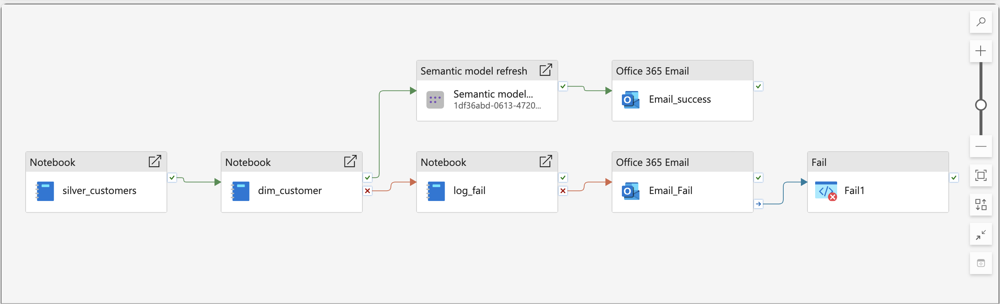
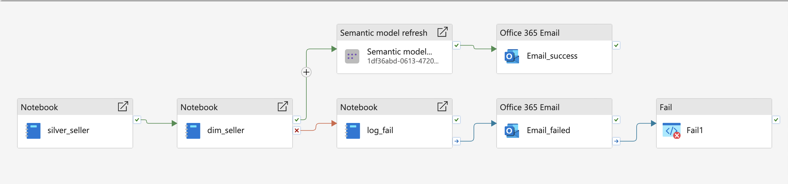
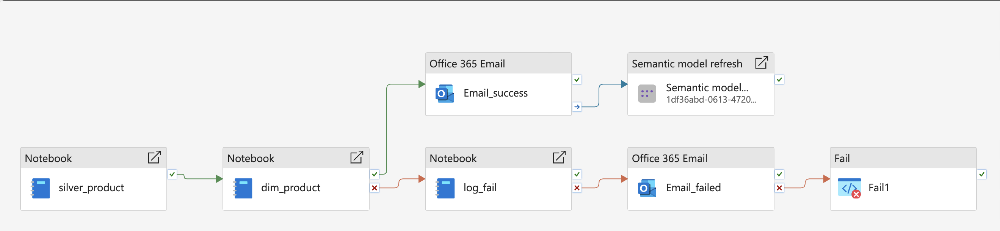

# Dimension Pipelines

## Overview

The dimension pipelines transform cleansed Silver-layer data into reusable Gold-layer dimension tables for analytical reporting in Microsoft Fabric.

These pipelines support the semantic model and Power BI dashboards by creating consistent business entities across the project.

## Dimension Tables

The main dimension tables in the Gold layer are:

- `dim_customer`
- `dim_seller`
- `dim_product`
- `dim_date`
- `dim_location`

---

## Customer Dimension Pipeline

The Customer Dimension pipeline transforms customer data from `silver_customers` into the Gold-layer `dim_customer` table.

This pipeline prepares reusable customer attributes for reporting and analysis, including geographic and customer-level descriptive information.

### Key attributes

- Customer ID
- ZIP code prefix
- City
- State
- Insert date
- Update date

### Processing Flow

```text
silver_customers
       |
       v
Customer transformation notebook
       |
       v
dim_customer
       |
       v
Semantic Model Refresh
```

### Pipeline Screenshot



---

## Seller Dimension Pipeline

The Seller Dimension pipeline transforms seller data from `silver_sellers` into `dim_seller`.

This dimension supports seller performance, revenue contribution, and regional seller analysis.

### Key attributes

- Seller ID
- ZIP code prefix
- City
- State
- Insert date
- Update date

### Processing Flow

```text
silver_sellers
       |
       v
Seller transformation notebook
       |
       v
dim_seller
       |
       v
Semantic Model Refresh
```

### Pipeline Screenshot



---

## Product Dimension Pipeline

The Product Dimension pipeline transforms product data from `silver_products` into `dim_product`.

It standardizes product attributes for category-level and product-level analytics.

### Key attributes

- Product ID
- Product category
- Product name length
- Product description length
- Product photo quantity
- Product weight
- Product dimensions
- Insert date
- Update date

### Processing Flow

```text
silver_products
       |
       v
Product transformation notebook
       |
       v
dim_product
       |
       v
Semantic Model Refresh
```

### Pipeline Screenshot



---

## Date Dimension

The `dim_date` table provides the calendar structure required for time intelligence and period-over-period reporting.

It supports:

- Date key
- Full date
- Day
- Month
- Quarter
- Year
- Weekday
- Time-based analytics

---

## Location Dimension

The `dim_location` table provides normalized geographic attributes for regional reporting and analysis.

It supports location-based slicing such as city, state, and ZIP code prefix groupings.

---

## Dependency Management

Dimension pipelines are orchestrated in a controlled sequence to ensure that downstream processes use clean and standardized dimension tables.

These dimension tables are then consumed by fact pipelines, the semantic model, and Power BI dashboards.