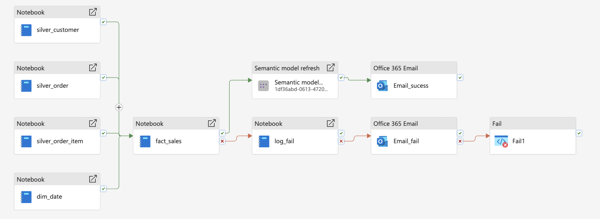
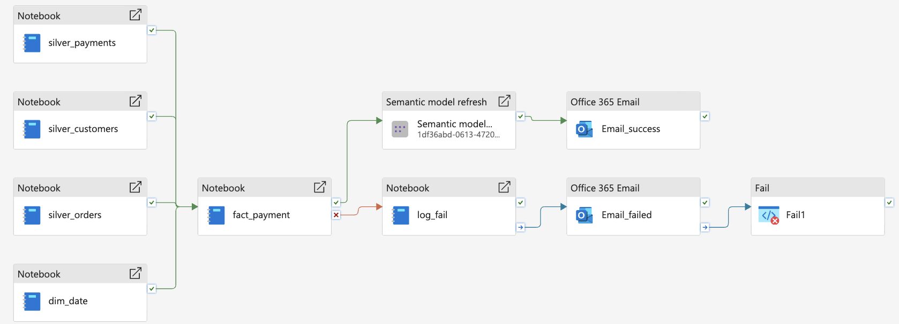
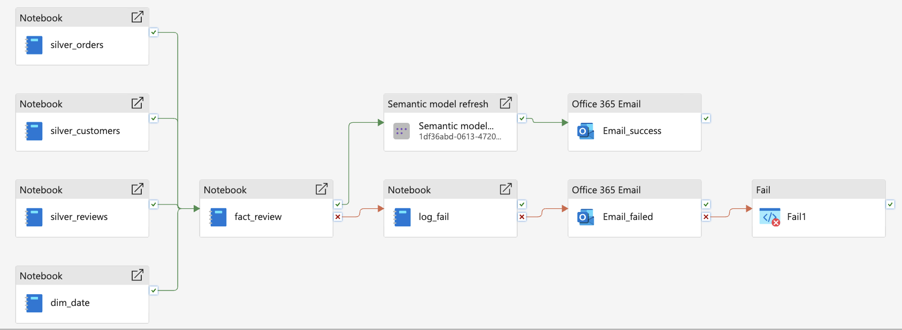
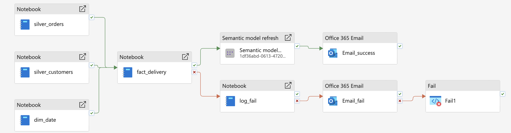
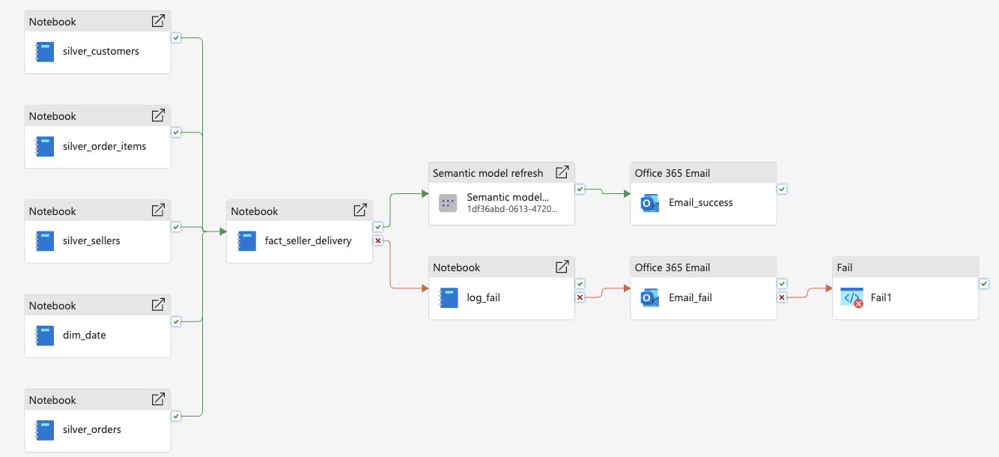
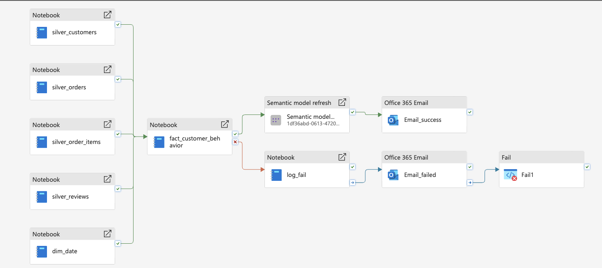

# Fact Pipelines

## Overview

The fact pipelines transform business events from the Silver layer into analytical fact tables in the Gold Lakehouse.

These fact tables are designed to support sales reporting, payment analysis, review analysis, delivery performance tracking, and customer behavior analysis.

The main fact pipelines in this project are:

- `fact_sales`
- `fact_payment`
- `fact_review`
- `fact_delivery`
- `fact_seller_delivery`
- `fact_customer_behavior`

---

## Fact Sales Pipeline

The Fact Sales pipeline transforms order-item-level data into the `fact_sales` table.

It supports order analysis, revenue analysis, seller performance reporting, and time-based sales analysis.

### Main metrics

- Product quantity
- Seller unit price
- Ordered product value
- Shipping cost
- Total order value
- Recognized revenue
- Order status

### Pipeline Screenshot

---

## Fact Payment Pipeline

The Fact Payment pipeline transforms payment transactions into `fact_payment`.

It supports payment method analysis, payment installment analysis, and order payment behavior reporting.

### Main metrics

- Payment value
- Payment type
- Installment count
- Payment sequence

### Pipeline Screenshot

---

## Fact Review Pipeline

The Fact Review pipeline transforms review data into `fact_review`.

It supports customer sentiment analysis, review response analysis, and review score reporting.

### Main metrics

- Review score
- Review group
- Has review flag
- Review response days

### Pipeline Screenshot

---

## Fact Delivery Pipeline

The Fact Delivery pipeline transforms logistics timestamps into `fact_delivery`.

It supports delivery lead time analysis, shipping performance analysis, and on-time delivery reporting.

### Main metrics

- Approval duration
- Shipping duration
- Delivery duration
- Estimated vs actual delivery
- Delivery status classification

### Pipeline Screenshot

---

## Fact Seller Delivery Pipeline

The Fact Seller Delivery pipeline supports seller-level delivery performance analysis.

It combines seller, order, and delivery data to measure operational performance by seller.

### Main metrics

- Seller-level delivery lead time
- Seller fulfillment timeline
- Delivered order counts by seller

### Pipeline Screenshot

---

## Fact Customer Behavior Pipeline

The Fact Customer Behavior pipeline supports customer-centric behavioral analysis.

It helps analyze customer ordering behavior, repeat purchase activity, and customer value trends.

### Main metrics

- Order frequency
- Customer purchase behavior
- Customer engagement patterns

### Pipeline Screenshot

---

## Fact Table Dependencies

Fact pipelines depend on cleansed Silver data and reusable Gold dimensions.

These fact tables are consumed by:

- Power BI semantic model
- Executive dashboard
- Sales performance report
- Payment analysis report
- Review analysis report