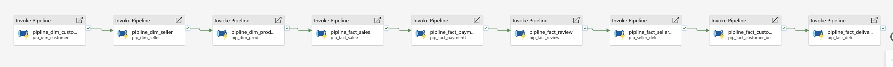

# Master ETL Pipeline

## Overview

The Master ETL pipeline orchestrates the end-to-end data processing workflow in Microsoft Fabric.

It coordinates data movement and transformation across the Medallion Architecture:

**Bronze -> Silver -> Gold -> Semantic Model -> Power BI**

## Pipeline Architecture

```text
Source Data
    |
    v
Bronze Lakehouse
    |
    v
Silver ETL Notebooks
    |
    v
Silver Lakehouse
    |
    v
Dimension & Fact Pipelines
    |
    v
Gold Lakehouse
    |
    v
Semantic Model Refresh
    |
    v
Power BI Reports

```
## Pipeline Screenshot

